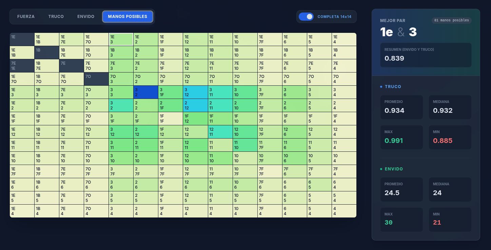

# Truco GTO

GTO Solver for the game Truco, as played in Argentina and Uruguay.

As with any Poker Solver, this engine helps players study the game of Truco with probabilities rather than hunches, so that they may play better.

### Under construction

The webapp is still being built. We'll have a working version, hosted live, this year.

# Representation

### Matrix

Each hand consists of 3 cards. To represent the hands appropriately in a 2x2 matrix, we pick the two best cards of each hand and add count the remaining third card as part of the hand. 

We then show aggregate strength (truco and envido) for all possible hands having this pair.

### Game

Player can note the progress of a single match by selecting actions per player, including truco and envido bets, and playing cards.

Note how, as the match advances, the matrix below changes: It reflects the ongoing probability of having each hand and the new relative strength of each hand, given all the cards played.

Note also how playing (especially announcing) envido changes the probability and strength of hands.

# Features

Including

1. Whats the chance of having each sub-hand (pair) as strongest (given two best cards, with or without envido)
2. Envido strength: what's the relative strength of your envido (almost a fixed probability: these don't change much as the game advances). Some info you can get out of this:
    - Whats the chance your envido/flor is best in table
    - Whats the range of hands you could have
    - Whats the range of hands your oponents could have
    - What card reveals less, or contradictory, info (eg. 33 envido with 2m + 3, showing any 7 will bluff)
3. Truco strength: what's the relative strength of your hand in truco, given what you know about your oponents (especially what cards they played and what envido they announced).

TODO: how is truco strength calculated
    - given sorted cards played against each other, against how many hands do you win
    - given unsorted, against how many hands do you win
