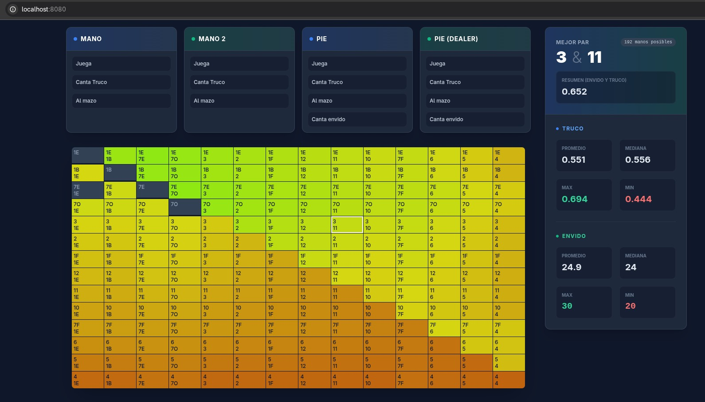

# Solver for the game Truco, as played in Argentina and Uruguay



### Features
1. Whats the chance of each sub-hand (given two best cards, with or without envido) -- only relevant if we have UI
2. Given your hand
    - Calc your envido / flor points (easy)
    - Calc 'truco' strength
        - given sorted cards played against each other, against how many hands do you win
        - given unsorted, against how many hands do you win
    So we get:
    - Whats the chance that your hand is better than one (or more) oponents
    - Trailing: given we fix some piece of information, how do these probabilites change
3. Given your envido
    - Whats the chance your envido/flor is best (medium)
    - Whats the range of hands you could have (hard)
    - Bonus: what card reveals less, or contradictory, info (eg. 33 envido with 2m + 3, showing any 7 will bluff)
    - Trailing: given we fix some piece of information, how do these probabilites change
4. Guess range of other players given limited info
    - Flor (score)
    - Envido (score or partial score)
    - Individual cards

### TODO UI:
- select past turns:
    - without breaking history
    - enable undo logic (change card or action)
- track user data beside their name: declared envido / shown cards
    - once you click on any player action, the matrix should reflect the changes of stats relevant to this user
- unify envido into same tracker action
- settings on top
    - num players
    - Separate between arg & uru
- nicer styles
- choose mCards and kCards out of a 4x10 matrix
    then also choose an envido
- on click
    ### finish identifying your hand:
    - choose the third card
    - choose envido
    ### stats:
    - % chance you can get this hand
    - strength (truco and envido)
    - % hands you can win (similar to strength)
- main matrix: relevant info
    - que cartas puedo tener - my range
    - que chance hay que mis cartas sean las mejores de la mesa - strength
    - que cartas puede tener el otro
- translate error messages from fsm

### add stats
- chance that your hand is best in table, given known info
- chance that your envido is best in table, given known info

### TODO backend
- TrucoStrength does not capture the practical stregth, because there are some permutations that will never be reasoanably played. Eg:
    - Tie the first round, you should play your strongest card right away.
    - If you lost the first round, you should not tie any other round, unless you're loosing anyway.
    Meaning, some hands seem stronger, or weaker, than they should. My intuition is that real strength polarizes scores even more: as strong hands would not loose is dumb ways, and viceversa (as score is calculated by averaging agains all possible hands). Mid-range hands would also tend to stay mid-range. I expect there to be no extreme cases where this drastically changes a hand's overall score.
- EV features (harder):
    1. EV of playing your envido. Considering
        - You may lose
        - You give away information
    2. EV of calling truco. Considering
        - information you have on others (their range)
        - information you gave away (your range)
    3. EV of each card played at each step

### Uruguay
- Make sure to reuse generic functions

### Next steps
- host in a free tier server (fly.io, gcp, render)
- hover on different elements also shows hints in the bottom, explaining UI
    - tutorial?
- Track progress of a hand
    - scrollable action tracker
    - The matrix will constantly be updated every time some player makes an action
    - make a nicer card chooser (and reduce the options based on info available)
- remake matrix to be a triangle - we dont really care for separation between envido and non envido
    - Finish selecting a hand in with a third click (maybe 2 clicks: number, suit)
- Define what metrics are encoded with color in the matrix

Envido scores:
```
tn| nq  quiero
1 | 1 - 2
1 | 1 - 3
1 | 1 - 255

2 | 2 - 4
2 | 2 - 5
2 | 2 - 255

3 | 4 - 7
3 | 5 - 255

4 | 7 - 255
```

### References
https://quanam.com/todo-lo-que-siempre-quisiste-saber-del-truco-uruguayo/
